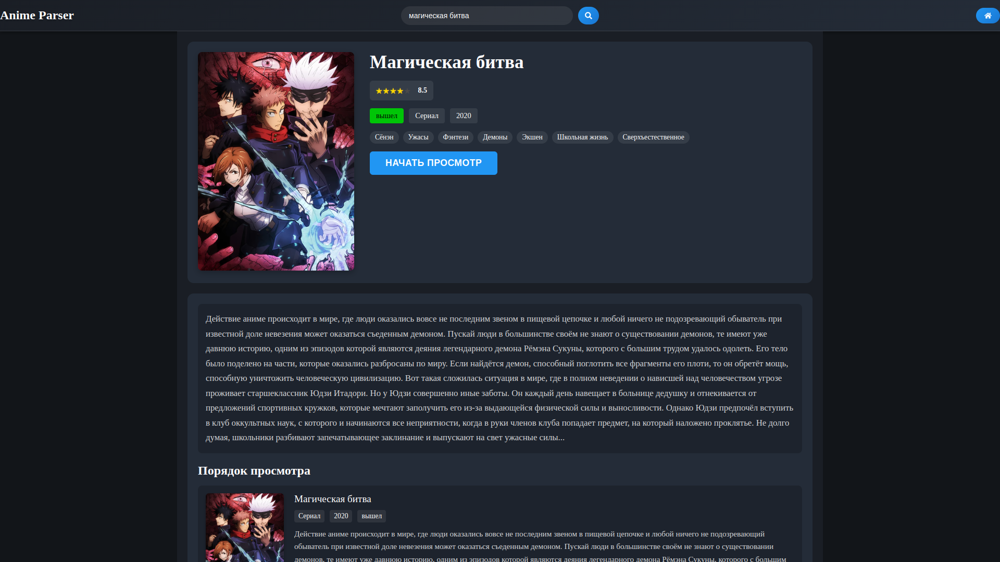
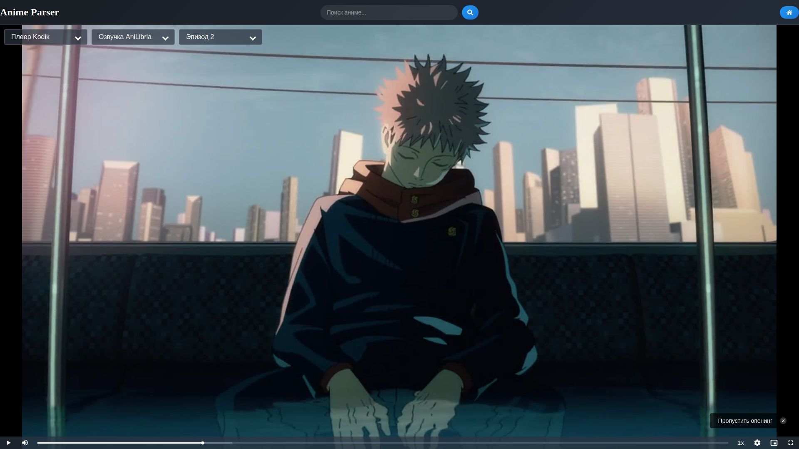
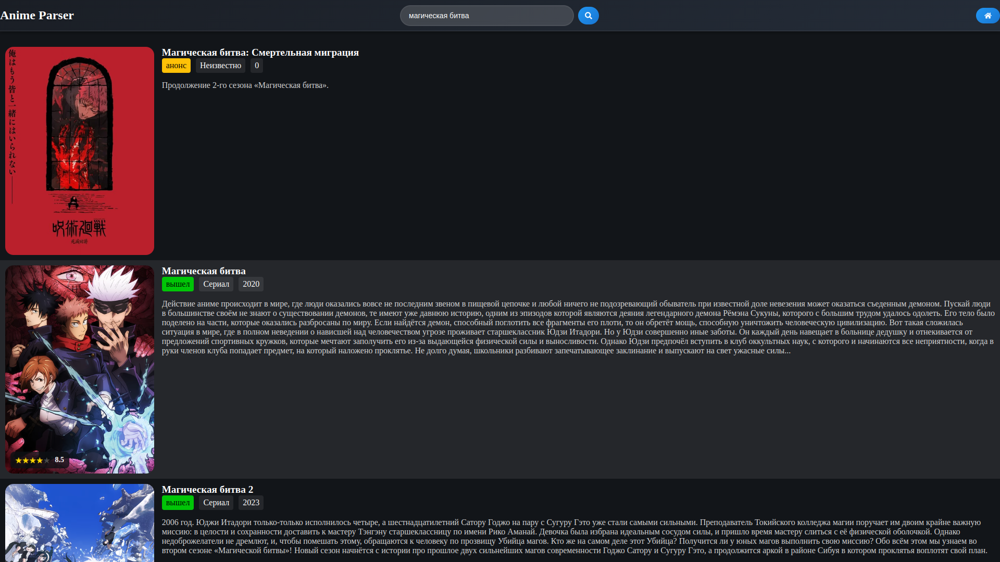
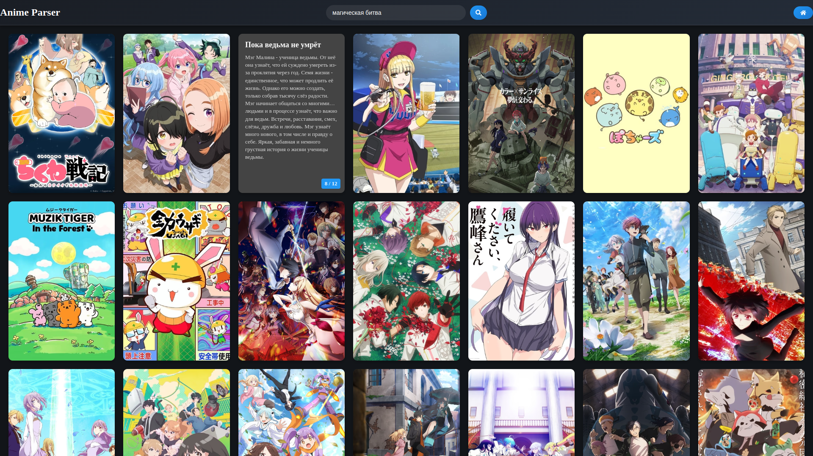

# AniParser

[](https://opensource.org/licenses/MIT)
[](https://github.com/sinedka/aniparser/releases)
[](https://github.com/sinedka/aniparser/issues)

AniParser — это современное приложение для просмотра аниме, которое агрегирует контент с различных источников. Благодаря умному парсингу сайтов и интеграции с различными API, приложение предоставляет удобный доступ к огромной библиотеке аниме в одном месте.

## Скриншоты

<div align="center">
  
  <p><em>Страница аниме</em></p>
  
  
  <p><em>Встроенный видеоплеер</em></p>
  
  
  <p><em>Страница поиска</em></p>

  
  <p><em>Страница с онгоингами</em></p>
</div>

## Основные возможности

- Поддержка различных источников контента
  - Интеграция с Yummi-anime
  - Планируется добавление новых источников
- Встроенные видеоплееры
  - Поддержка Kodik плеера
  - Планируется добавление новых плееров
- Поиск по всем подключенным источникам
- Отображение онгоингов
- Адаптивный пользовательский интерфейс

## Технические детали

Проект разработан с использованием современного стека технологий:

- **Electron** — для создания кроссплатформенного десктопного приложения
- Вбран вместо Tauri из-за лучшей поддержки HLS в WebKit
- **React** — для построения отзывчивого пользовательского интерфейса
- **TypeScript** — для обеспечения типобезопасности и улучшения поддерживаемости кода
- **Vite** — для быстрой разработки и оптимизированной сборки

## Установка

#### Arch Linux

```bash
yay -S aniparser
```

#### Другие системы

Скачайте последнюю версию приложения со [страницы релизов](https://github.com/sinedka/aniparser/releases)

## TODO

#### Основной функционал

- [ ] Добавить поддержку новых источников аниме
  - [ ] AniLibria
  - [ ] SovetRomantica
  - [ ] AnimeGO
- [ ] Интегрировать дополнительные видеоплееры
  - [ ] Sibnet
  - [ ] Alloha

#### Улучшения интерфейса

- [ ] Переделать интерфейс в Spotify стиль
- [ ] Темная/светлая тема
- [ ] Кастомизация интерфейса
- [ ] Поддержка горячих клавиш
- [ ] Улучшенные фильтры поиска

#### Технические улучшения

- [ ] Добавить возможность Загрузки аниме и просмотра офлайн

## Contributing

Мы всегда рады вкладу в развитие проекта! Если вы хотите помочь:

1. Форкните репозиторий
2. Создайте ветку для ваших изменений
3. Для масштабных изменений сначала создайте issue или обсуждение
4. Убедитесь, что ваш код соответствует стилю проекта
5. Сделайте pull request с подробным описанием изменений

## License

Проект распространяется под лицензией MIT. Подробности смотрите в файле [LICENSE](LICENSE).
